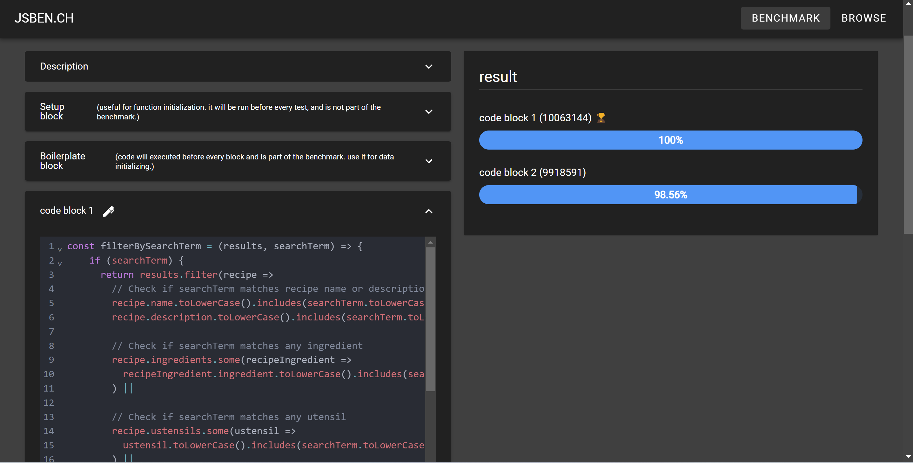
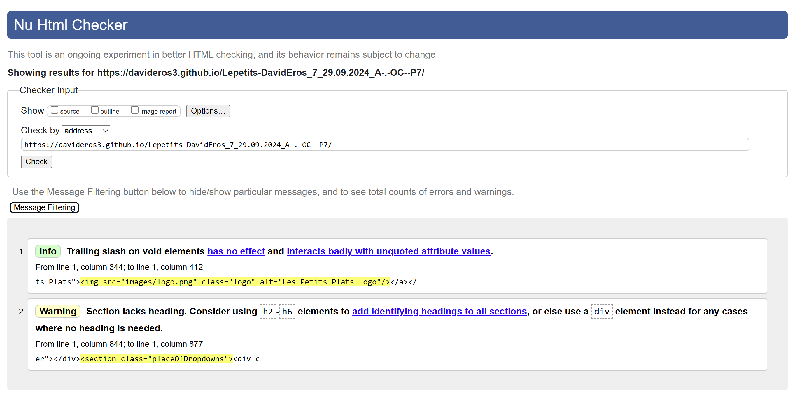

This project is a recipe search and filtering system built with JavaScript and Bootstrap. It allows users to search for recipes by ingredients, appliances, and utensils using an interactive filtering system. The UI includes dropdowns for selecting filters and dynamically generated tag buttons for added flexibility.

Features ✅ Search and filter recipes by ingredients, utensils, and appliances ✅ Dynamic filtering with real-time updates ✅ Tag-based filtering with removable tags ✅ Dropdowns dynamically populated with available filter options

Branches master branch - filter-map-search - Implements the search using the .filter() methods for better readability search_2 - Implements the search function using traditional loops (for)

Link to github repository: https://github.com/davideros3/Lepetits-DavidEros_7_29.09.2024_A-.-OC--P7
